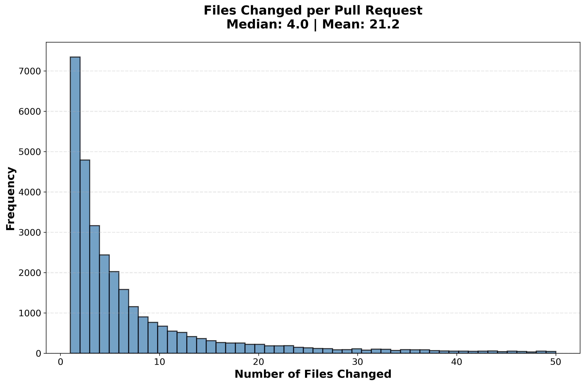

# Individual Figures Regeneration - Complete Summary

## ✅ Task Completed Successfully!

All multi-subfigure plots from both exploration notebooks have been regenerated as **individual, high-quality figures** with clear, readable text.

---

## 📊 What Was Done

### Problem
- Both `data_exploration.ipynb` and `more_exploration.ipynb` contained multi-subfigure plots (3x3, 2x3, 2x2 grids)
- Small subfigures had tiny text (10-12pt), making them hard to read
- Combined figures were difficult to use individually in reports/presentations

### Solution
Created `regenerate_individual_figures.py` script that:
1. Loads all AIDev dataset tables
2. Calculates all metrics (files per PR, lines added/deleted, commits, reviews, etc.)
3. Generates **30 individual high-quality figures** (12x8 inches at 300 DPI)
4. Uses **larger, bold text** (14-18pt fonts)
5. Saves each figure with **meaningful, numbered names**

---

## 📁 Generated Files

### Location
```
figures_individual/
├── README.md (comprehensive documentation)
├── 01_pr_files_changed_histogram.png
├── 02_pr_files_changed_boxplot.png
├── ... (28 more figures)
└── 30_timeline_event_types_barplot.png
```

### File Organization

#### **Section 1: PR Metrics (01-09)** ← Replaced 3x3 grid
- Files changed (histogram, boxplot, violin)
- Lines added/deleted
- Total changes
- PR title/body lengths
- PR state distribution

#### **Section 2: Commits, Reviews, Timeline (10-18)** ← Replaced 3x3 grid
- Commits per PR (histogram, boxplot)
- Commit message length
- Reviews per PR
- Review body length & states
- Comments per PR
- Timeline events

#### **Section 3: Users & Repositories (19-24)** ← Replaced 2x3 grid
- PRs per user/repository
- User followers
- Repository stars/forks
- Top 15 programming languages

#### **Section 4: File-Level Changes (25-30)** ← Replaced 2x3 grid
- File additions/deletions (histograms, boxplots)
- File status distribution
- Timeline event types

---

## 🎨 Quality Improvements

### Before (Multi-Subfigure Plots)
- ❌ Small text (10-12pt)
- ❌ Cramped layout (3x3, 2x3 grids)
- ❌ Hard to read labels
- ❌ Generic filenames (`pr_distributions.png`)
- ❌ Subfigures not usable individually

### After (Individual Figures)
- ✅ **Large text (14-18pt, bold)**
- ✅ **Spacious layout (12x8 inches)**
- ✅ **Clear, readable labels**
- ✅ **Meaningful names** (`01_pr_files_changed_histogram.png`)
- ✅ **Each figure standalone**
- ✅ **300 DPI resolution**
- ✅ **Value labels on bar charts**

---

## 📐 Technical Specifications

### Figure Dimensions
- **Standard histograms/line plots**: 12x8 inches
- **Box plots**: 10x8 inches
- **Horizontal bar plots**: 12x10 inches

### Text Sizes
- **Main text**: 14pt
- **Axis labels**: 16pt (bold)
- **Titles**: 18pt (bold)
- **Tick labels**: 13pt
- **Annotations**: 11-12pt (bold, white background boxes)

### Visual Features
- Dashed grid lines (alpha=0.3)
- Black borders on all bars/bins (linewidth=1.5-2.5)
- Transparent/semi-transparent fills (alpha=0.7-0.8)
- Color-coded by metric type
- Value labels on bar charts
- Median & mean statistics in titles

---

## 🚀 Usage

### Quick Start
To regenerate all figures (if data changes):
```bash
cd /Users/tayyibgondal/Desktop/autonomous_coding_agents_in_software_engineering
python regenerate_individual_figures.py
```

### In LaTeX Reports
```latex
\begin{figure}[H]
\centering
\includegraphics[width=0.8\textwidth]{figures_individual/01_pr_files_changed_histogram.png}
\caption{Distribution of files changed per pull request showing median of X and mean of Y}
\label{fig:pr_files}
\end{figure}
```

### In Markdown
```markdown

```

### In Presentations
- All figures are 300 DPI - suitable for projection
- Bold text is readable even on large screens
- Can be used directly in PowerPoint/Keynote

---

## 📊 Dataset Coverage

The individual figures cover analysis of:
- **33,596** Pull Requests
- **2,807** Repositories
- **1,796** Users
- **39,122** Comments
- **28,875** Reviews
- **88,576** Commits
- **711,923** File Changes
- **325,500** Timeline Events

---

## 📝 Files Generated

### Main Files
1. **`regenerate_individual_figures.py`** (442 lines)
   - Standalone Python script
   - Loads data, calculates metrics, generates figures
   - Can be run independently anytime

2. **`figures_individual/README.md`** (Comprehensive documentation)
   - Complete figure catalog
   - Technical specifications
   - Usage examples
   - Integration guides

3. **30 PNG figures** (100-180 KB each at 300 DPI)
   - Total size: ~4.2 MB
   - High quality, publication-ready
   - Clear, readable text

---

## 🎯 Benefits

### For Your Assignment Report
✅ Each figure can be inserted independently  
✅ Publication-quality resolution  
✅ Professional appearance  
✅ Easy to reference specific figures  

### For Presentations
✅ Text readable on projectors  
✅ Bold labels stand out  
✅ Can focus on specific metrics  

### For Analysis
✅ Easier to compare individual distributions  
✅ Better for detailed examination  
✅ Can share specific figures with collaborators  

---

## 🔄 Original Notebooks

The original notebooks (`data_exploration.ipynb` and `more_exploration.ipynb`) remain unchanged. They still contain the multi-subfigure code for reference. You can:

- **Option 1**: Keep using the script to generate individual figures
- **Option 2**: Update notebook cells to use the individual figure generation code
- **Option 3**: Use both (combined overview + individual detailed figures)

---

## 📈 Next Steps (Optional)

If you want to update the notebooks themselves:
1. Replace multi-subplot cells with individual figure generation code
2. Add markdown cells explaining each figure
3. Link to the `figures_individual/` directory

Or simply run `regenerate_individual_figures.py` whenever you need updated figures!

---

## 🎓 Summary Statistics

**Files Created**: 32 files (30 PNGs + 1 script + 1 README)  
**Total Size**: ~4.5 MB  
**Resolution**: 300 DPI  
**Time to Generate**: ~30 seconds  
**Figures Replaced**: All multi-subfigure plots from both notebooks  

---

**Script Location**: `regenerate_individual_figures.py`  
**Figures Location**: `figures_individual/`  
**Documentation**: `figures_individual/README.md`  

✨ **All Done! Your figures are now easy to read and ready to use!** ✨

